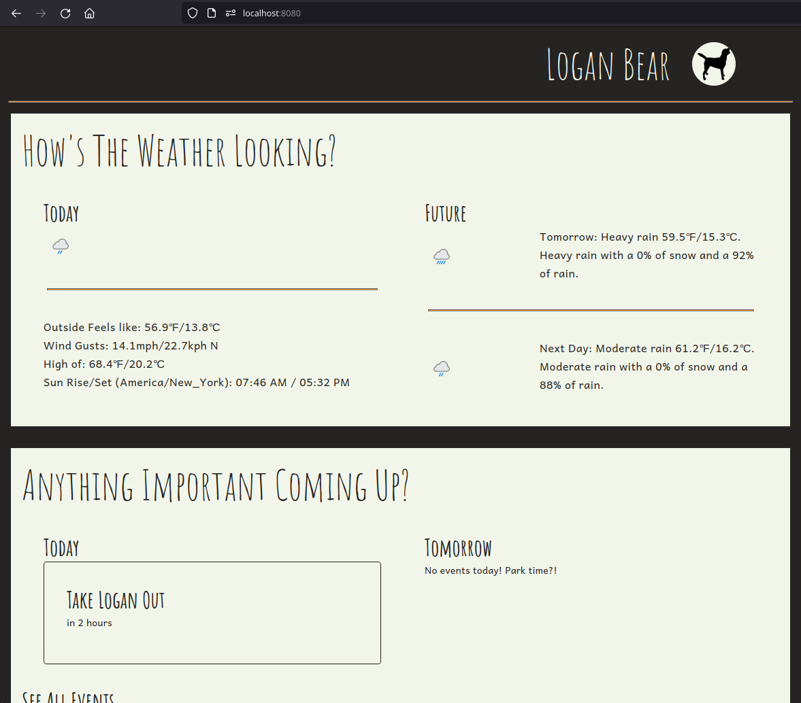
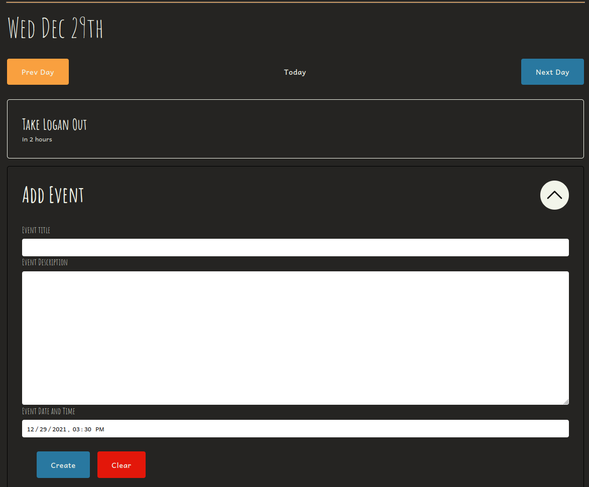
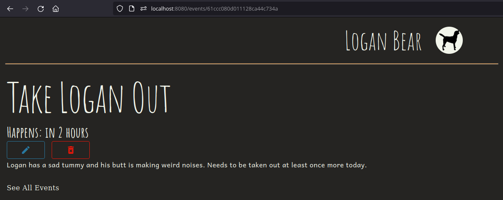

# Logan Bear

## Getting Started

```sh

docker-compose up --build
```

## Development

```sh
## Start
docker-compose \
  -f docker-compose.base.yaml \
  -f docker-compose.dev.yaml \
  up \
  --remove-orphans \
  --build

## Totally remove and start over
docker-compose \
  -f docker-compose.base.yaml \
  -f docker-compose.dev.yaml \
  down
```

## Screenshots




